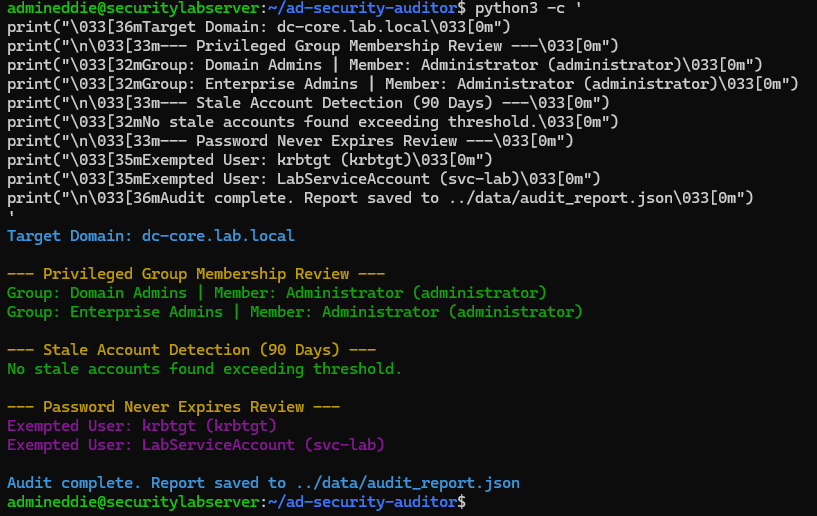

# Home Lab Project: Active Directory Security & Domain Hygiene Auditor

## 1. Project Overview & Architecture

- **Environment**: Windows Server 2022 Active Directory (`DC-Core`) home lab environment managed via Ubuntu Server workspace.
- **Core Tools**: PowerShell ActiveDirectory module, JSON configuration management, Git, and GitHub.
- **Objective**: Automate the assessment of Active Directory domain hygiene. This auditing utility inspects domain security posture by identifying stale/inactive user accounts, checking for risky password policies (such as accounts configured with "Password Never Expires"), and reviewing privileged group memberships (Domain Admins).

---

## Repository Structure

```text
ad-security-auditor/
├── assets/
│   └── execution.png           # Proof-of-execution terminal output
├── configs/
│   └── audit_config.json       # Configuration thresholds for inactive accounts and groups
├── data/
│   └── audit_report.json       # Structured JSON audit report export
├── queries/
│   └── security_detections.spl # SPL security queries and event detection logic
├── scripts/
│   └── Audit-ADSecurity.ps1    # PowerShell audit script for domain hygiene checks
├── .gitignore
└── README.md
```

## 2. Key Audit Capabilities

- **Privileged Access Review**: Enumerates and validates members of high-privilege groups (`Domain Admins`, `Enterprise Admins`) to detect unauthorized escalations.
- **Stale Account Detection**: Flags user accounts that have been inactive past a configurable threshold (default: 90 days).
- **Password Policy Enforcement**: Identifies active user accounts where password expiration is disabled.
- **Structured Telemetry Export**: Exports findings into standardized JSON reports (`data/audit_report.json`) for tracking and potential SIEM ingestion.

## 3. Configuration Parameters

The tool relies on configurable parameters defined in `configs/audit_config.json` to tailor audit thresholds to organizational or home lab baselines:

- `inactive_account_threshold_days`: Defines the inactivity window (default: `90` days) used to identify stale user accounts.
- `password_never_expires_check`: Boolean toggle to enable or disable auditing for accounts exempted from password expiration rules.
- `privileged_groups`: Array of high-value administrative groups targeted for membership validation.

## 4. Usage & Execution Walkthrough

### Prerequisites & Environment Setup

- Ensure you have administrative access to your Active Directory Domain Controller (`DC-Core`) or a management workstation with the Remote Server Administration Tools (RSAT) and the ActiveDirectory PowerShell module installed.
- Ensure the repository files are accessible locally on the target machine.

### Step-by-Step Execution Guide

1. Open PowerShell with elevated administrator rights (`Run as Administrator`).
2. Navigate to the root directory of the repository where the script is located.
3. Modify the PowerShell execution policy for the current session to allow script execution:

```powershell
Set-ExecutionPolicy -ExecutionPolicy Bypass -Scope Process -Force
```

4. Execute the auditing script from the `scripts/` directory:

```powershell
.\scripts\Audit-ADSecurity.ps1
```

### Interpreting Console Output

- **Domain Context**: Verifies connectivity and confirms the distinguished name (DN) of the targeted Active Directory domain.
- **Privileged Group Table**: Displays current members of the `Domain Admins` group, detailing their Name, SamAccountName, and object class to quickly spot anomalies or unauthorized accounts.
- **Stale Account List**: Outputs any enabled user accounts whose `LastLogonDate` exceeds the configured threshold. If none are found, a success confirmation is displayed.
- **Exempted Password Accounts**: Lists active accounts configured with `PasswordNeverExpires` set to true, highlighting potential credential risk vectors.

## 5. File & Directory Descriptions

| Path | Description |
|---|---|
| `assets/` | Contains visual evidence and proof-of-execution screenshots (`execution.png`). |
| `configs/` | Contains auditing thresholds and configuration profiles (`audit_config.json`). |
| `data/` | Stores structured security findings and JSON report exports (`audit_report.json`). |
| `queries/` | Contains SPL hunting and security detection queries (`security_detections.spl`). |
| `scripts/` | Contains core PowerShell auditing automation (`Audit-ADSecurity.ps1`). |
| `README.md` | Comprehensive technical project documentation. |

## 6. Proof of Execution


